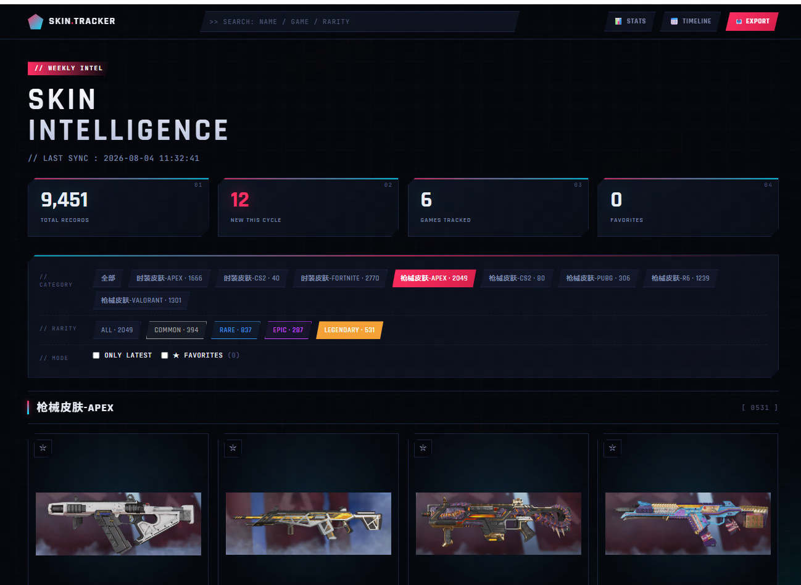

# Skin Tracker · 射击游戏皮肤情报站

> 一个自动化追踪主流射击游戏商业化外观资源的工具，面向**射击游戏商业化策划**的市场调研场景。
>
> **9,451 条**皮肤数据 · **6 款**主流射击游戏 · 每周一自动更新

## 🎯 项目背景

作为射击游戏商业化策划，日常工作核心之一是**设计枪械皮肤和角色时装**，而灵感来源和市场判断依赖于对**竞品商业化资源**的持续追踪。

传统做法是每周手动打开各游戏的 Wiki、Steam 市场、官方展示页翻找新品，效率低、易漏、无沉淀。

本项目通过一套自动化爬虫 + 本地展示站，把这个过程**从每周 2 小时压缩到每周 30 秒**（打开网页看周报即可）。

## ✨ 功能亮点

- 🕷️ **多源自动爬取**：CS2 / Valorant / Fortnite / Apex / PUBG / R6，各游戏用最适合的公开数据源
- 📅 **增量识别新增**：每周对比，自动标记本次新出现的皮肤（NEW 徽标 + 独立筛选）
- 🎨 **品质体系还原**：保留每款游戏原生品质命名（隐秘 / Ultra / Legendary / Icon Series ...），按品质色渲染卡片和筛选器
- 🔍 **实时搜索**：跨游戏、跨分类、跨品质关键词联合搜索
- ⭐ **收藏功能**：本地 localStorage 存储，一键收藏心仪设计
- 📤 **一键导出 Excel**：筛选后的皮肤直接导出为工作用的 xlsx 表格
- 📊 **数据可视化**：各游戏分布 / 分类占比 / 上新时间轴
- 📮 **周报自动生成**：每周一自动跑爬虫 → 生成 PNG 长图 → 可直接分享

## 🎮 已覆盖游戏

| 游戏 | 数据条目 | 数据源 | 品质数据 |
|---|---|---|---|
| Apex Legends | 3,715 | apexlegends.fandom.com | ✅ 5 档 |
| Fortnite | 2,937 | fortnite-api.com | ✅ 17 档（含系列） |
| Valorant | 1,301 | valorant-api.com | ✅ 5 档 |
| Rainbow Six Siege | 1,239 | rainbowsix.fandom.com | — |
| PUBG | 326 | pubg.fandom.com | — |
| CS2 | 120 | ByMykel/CSGO-API | ✅ 8 档 |

已调研但不接入：Call of Duty、Battlefield、Delta Force、The Finals（数据源不满足自动化条件，详见调研记录）

## 🖼️ 展示




## 🛠️ 技术栈

- **爬虫**：Python + requests + BeautifulSoup
- **存储**：SQLite（单文件，零配置）
- **前端**：原生 HTML + Tailwind CDN + Chart.js + SheetJS
- **周报生成**：Pillow
- **定时任务**：Windows 任务计划程序（每周一 09:00 自动跑）

选择原生前端而非框架的原因：作品集展示场景下**加载速度 > 开发效率**，且 9000+ 条数据用了自定义分批渲染优化。

## 📂 项目结构

```
skin-tracker/
├── crawlers/            # 每个游戏一个爬虫模块
│   ├── cs2.py
│   ├── valorant.py
│   ├── fortnite.py
│   ├── apex.py
│   ├── pubg.py
│   └── r6.py
├── web/
│   ├── index.html       # 展示页面（游戏风视觉）
│   └── data.json        # 前端数据（自动生成）
├── db.py                # SQLite 数据存取 + diff 逻辑
├── main.py              # 入口：爬取 + 导出 + 启动网页服务
├── export_json.py       # 数据库 → JSON
├── report.py            # 周报 PNG 生成器
├── run.bat              # 一键启动
├── view.bat             # 只启动网页（不重新爬）
└── weekly_task.bat      # 每周自动任务
```

## 🚀 本地运行

```bash
# 1. 安装依赖
pip install -r requirements.txt

# 2. 一键启动（爬取 + 打开网页）
python main.py

# 或分离操作
python main.py fetch    # 只爬取
python main.py serve    # 只启动网页
```

浏览器打开 http://127.0.0.1:8765 即可。

## 💭 设计思路

### 为什么"新上"判定用数据库 diff 而不是爬 API 的时间字段？

大多数游戏的社区数据源（Fandom Wiki、valorant-api）**不带发布日期字段**。方案是：
- 首次跑爬虫全量入库（作为基线）
- 之后每次跑前先把所有 `is_new` 清零
- 爬取过程中**首次插入的记录** `is_new=1`
- 差集 = 本周新增 ✅

### 为什么各游戏保留原始品质名而不统一映射？

CS2 的"隐秘"和 Valorant 的"Ultra"数值上大致对应，但**作为策划，品质名本身就是设计文化的一部分**——统一映射会损失专业视角。所以每款游戏独立品质体系，选择该游戏分类时才显示对应品质筛选器。

## ⚖️ 版权声明

- 本项目所有皮肤图片**均通过 URL 引用原始数据源**，不做转存
- 数据仅供个人**调研学习**使用，不用于任何商业用途
- 所有游戏、皮肤名称、图片版权归各游戏开发商所有

## 🤖 关于开发方式

本项目是使用 **vibecoding** 方式（AI 辅助编程）从需求到落地约 **1 天**完成。核心逻辑、爬虫策略、视觉设计的决策都由我把控，AI 帮助我快速实现具体代码。

作品集想传达的不是"AI 帮我做了一个项目"，而是**作为商业化策划，如何用现代工具链快速把一个业务想法变成可用的产品**。
